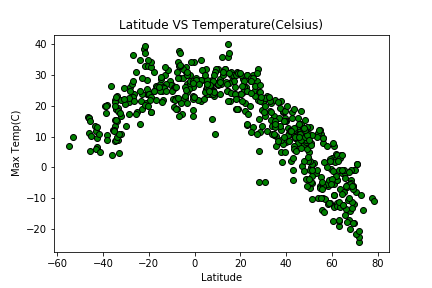
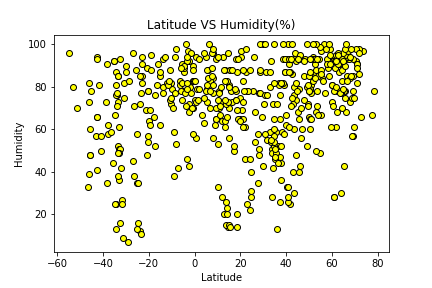
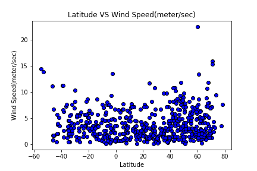

# What's the Weather Like?
Analyst objective is to build a series of scatter plots to showcase the following relationships:

*Temperature (F) vs. Latitude

*Humidity (%) vs. Latitude

*Cloudiness (%) vs. Latitude

*Wind Speed (mph) vs. Latitude

# Data Model
The datafrome contains 500+ rows in all of the follwing columns:

*1.CityLatitude

*2.CityLongitude

*3.MaxTemperature

*4.Humidity

*5.CloudCoverage

*6.WindSpeed

*7.CityCountry

*8.CityDatetime

# Tools: 

Python 3.7, python Pandas, API, citypy library, numpy, requests

 pip install citypy

# Knowledge:
1. [GeoGraphic Coordinate System](https://desktop.arcgis.com/en/arcmap/10.3/guide-books/map-projections/about-geographic-coordinate-systems.htm)
2. [Citipy](https://pypi.python.org/pypi/citipy)
3. [OpenWeatherMap API](https://openweathermap.org/api)

# Results

* Temperature (F) vs. Latitude

* Humidity (%) vs. Latitude

* Cloudiness (%) vs. Latitude

* Wind Speed (mph) vs. Latitude

